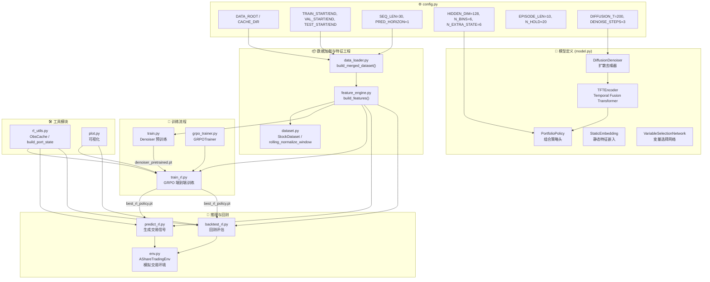
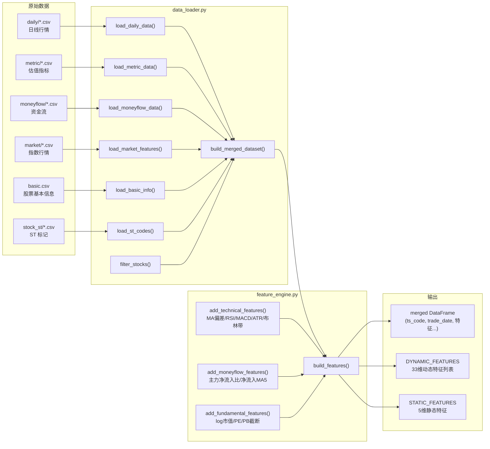
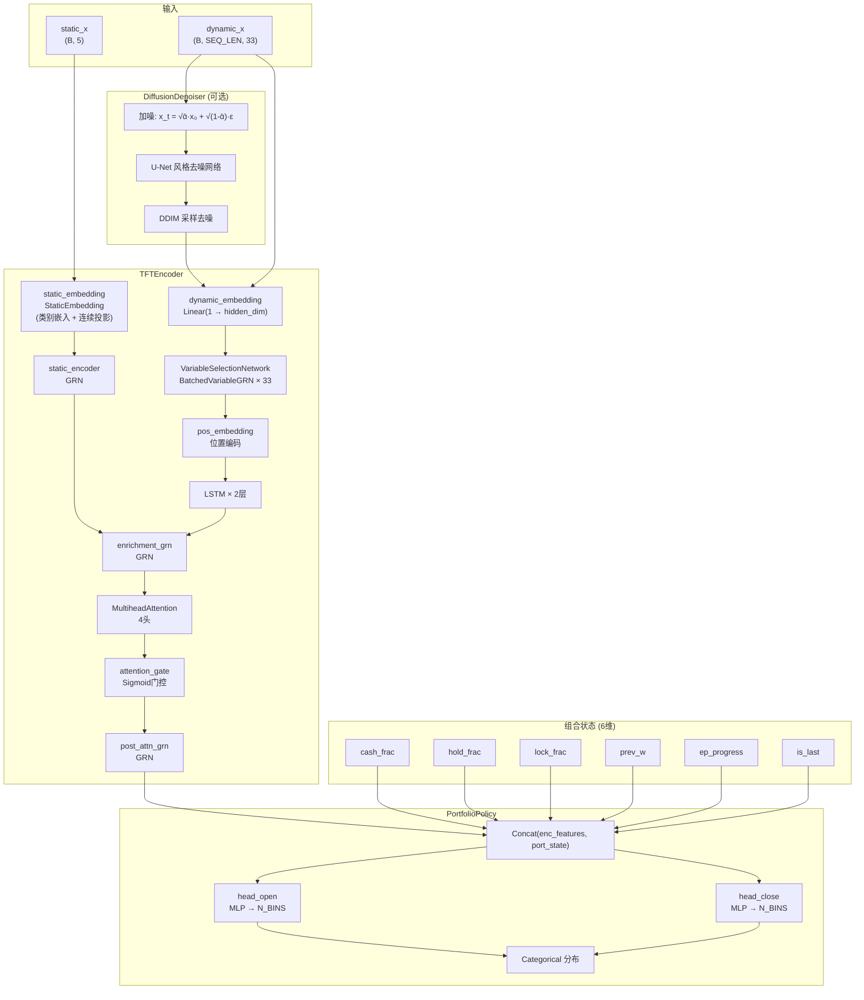
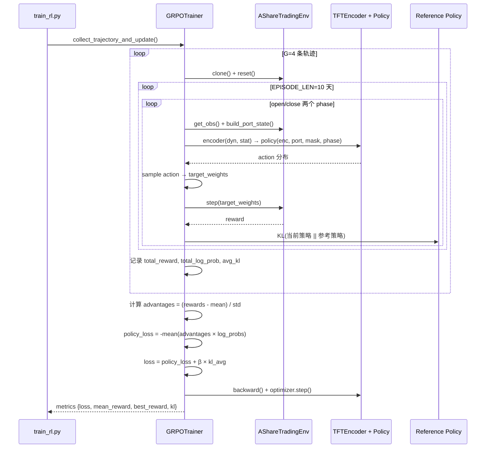

# 项目架构与数据流图

## 整体数据流



## 训练数据流（详细）



## 模型架构



## GRPO 训练流程



## 文件依赖关系

```mermaid
flowchart LR
    subgraph Core["核心模块"]
        config["config.py"]
        model["model.py"]
        env["env.py"]
    end

    subgraph Data["数据处理"]
        dl["data_loader.py"]
        fe["feature_engine.py"]
        ds["dataset.py"]
    end

    subgraph RL["强化学习"]
        rl["rl_utils.py"]
        grpo["grpo_trainer.py"]
    end

    subgraph Scripts["执行脚本"]
        train["train.py"]
        train_rl["train_rl.py"]
        predict["predict.py (DEPRECATED)"]
        backtest["backtest.py (DEPRECATED)"]
        predict_rl["predict_rl.py"]
        backtest_rl["backtest_rl.py"]
    end

    subgraph Viz["可视化"]
        plot["plot.py"]
    end

    subgraph Test["测试"]
        test_env["tests/test_env.py"]
    end

    %% 依赖关系
    dl --> config
    fe --> config
    ds --> config
    ds --> fe
    model --> config
    env --> config
    rl --> config
    rl --> ds
    rl --> fe
    grpo --> config
    grpo --> rl

    train --> config
    train --> dl
    train --> fe
    train --> model

    train_rl --> config
    train_rl --> dl
    train_rl --> fe
    train_rl --> model
    train_rl --> env
    train_rl --> grpo
    train_rl --> rl
    train_rl --> plot

    predict_rl --> config
    predict_rl --> dl
    predict_rl --> fe
    predict_rl --> model
    predict_rl --> env
    predict_rl --> rl

    backtest_rl --> config
    backtest_rl --> dl
    backtest_rl --> fe
    backtest_rl --> model
    backtest_rl --> env
